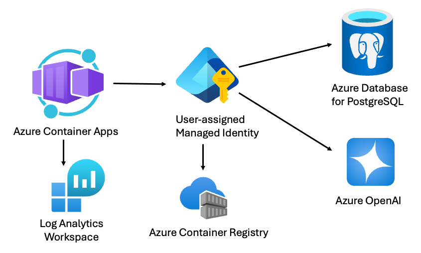

# RAG on PostgreSQL

[](https://codespaces.new/Azure-Samples/rag-postgres-openai-python)
[](https://vscode.dev/redirect?url=vscode://ms-vscode-remote.remote-containers/cloneInVolume?url=https://github.com/azure-samples/rag-postgres-openai-python)

This project creates a web-based chat application with an API backend that can use OpenAI chat models to answer questions about the rows in a PostgreSQL database table. The frontend is built with React and FluentUI, while the backend is written with Python and FastAPI.

This project is designed for deployment to Azure using [the Azure Developer CLI](https://learn.microsoft.com/azure/developer/azure-developer-cli/), hosting the app on Azure Container Apps, the database in Azure PostgreSQL Flexible Server, and the models in Azure OpenAI.

* [Features](#features)
* [Getting started](#getting-started)
  * [GitHub Codespaces](#github-codespaces)
  * [VS Code Dev Containers](#vs-code-dev-containers)
  * [Local environment](#local-environment)
* [Deployment](#deployment)
* [Local development](#local-development)
* [Costs](#costs)
* [Security guidelines](#security-guidelines)
* [Guidance](#guidance)
* [Resources](#resources)

## Features

This project provides the following features:

* Hybrid search on the PostgreSQL database table, using [the pgvector extension](https://github.com/pgvector/pgvector) for the vector search plus [full text search](https://www.postgresql.org/docs/current/textsearch-intro.html), combining the results using RRF (Reciprocal Rank Fusion).
* OpenAI function calling to optionally convert user queries into query filter conditions, such as turning "Climbing gear cheaper than $30?" into "WHERE price < 30".
* Conversion of user queries into vectors using the OpenAI embedding API.


## Architecture diagram

The deployed app uses a user-assigned managed identity to authenticate to Azure services, and stores logs in Log Analytics.



## Getting started

You have a few options for getting started with this template.
The quickest way to get started is GitHub Codespaces, since it will setup all the tools for you, but you can also [set it up locally](#local-environment).

### GitHub Codespaces

You can run this template virtually by using GitHub Codespaces. The button will open a web-based VS Code instance in your browser:

1. Open the template (this may take several minutes):

    [](https://codespaces.new/Azure-Samples/rag-postgres-openai-python)

2. Open a terminal window
3. Continue with the [deployment steps](#deployment)

### VS Code Dev Containers

A related option is VS Code Dev Containers, which will open the project in your local VS Code using the [Dev Containers extension](https://marketplace.visualstudio.com/items?itemName=ms-vscode-remote.remote-containers):

1. Start Docker Desktop (install it if not already installed)
2. Open the project:

    [](https://vscode.dev/redirect?url=vscode://ms-vscode-remote.remote-containers/cloneInVolume?url=https://github.com/azure-samples/rag-postgres-openai-python)

3. In the VS Code window that opens, once the project files show up (this may take several minutes), open a terminal window.
4. Continue with the [deployment steps](#deployment)

### Local Environment

1. Make sure the following tools are installed:

    * [Azure Developer CLI (azd)](https://aka.ms/install-azd)
    * [Node.js 18+](https://nodejs.org/download/)
    * [Python 3.9+](https://www.python.org/downloads/)
    * [PostgreSQL 14+](https://www.postgresql.org/download/)
    * [pgvector](https://github.com/pgvector/pgvector)
    * [Docker Desktop](https://www.docker.com/products/docker-desktop/)
    * [Git](https://git-scm.com/downloads)

2. Download the project code:

    ```shell
    azd init -t rag-postgres-openai-python
    ```

3. Open the project folder
4. Install required Python packages and backend application:

    ```shell
    pip install -r requirements-dev.txt
    pip install -e src/backend
    ```

5. Continue with the [deployment steps](#deployment)

## Deployment

Once you've opened the project in [Codespaces](#github-codespaces), [Dev Containers](#vs-code-dev-containers), or [locally](#local-environment), you can deploy it to Azure.

1. Sign in to your Azure account:

    ```shell
    azd auth login
    ```

    For GitHub Codespaces users, if the previous command fails, try:

   ```shell
    azd auth login --use-device-code
    ```

2. Create a new azd environment:

    ```shell
    azd env new
    ```

    This will create a folder under `.azure/` in your project to store the configuration for this deployment. You may have multiple azd environments if desired.

3. (Optional) If you would like to customize the deployment to [use existing Azure resources](docs/deploy_existing.md), you can set the values now.

4. Provision the resources and deploy the code:

    ```shell
    azd up
    ```

    You will be asked to select two locations, first a region for most of the resources (Container Apps, PostgreSQL), then a region specifically for the Azure OpenAI models. This project uses the gpt-4o-mini and text-embedding-3-large models which may not be available in all Azure regions. Check for [up-to-date region availability](https://learn.microsoft.com/azure/ai-services/openai/concepts/models#standard-deployment-model-availability) and select a region accordingly.

## Local Development

### Setting up the environment file

Since the local app uses OpenAI models, you should first deploy it for the optimal experience.

1. Copy `.env.sample` into a `.env` file.
2. To use Azure OpenAI, set `OPENAI_CHAT_HOST` and `OPENAI_EMBED_HOST` to "azure". Then fill in the values of `AZURE_OPENAI_ENDPOINT` and `AZURE_OPENAI_CHAT_DEPLOYMENT` based on the deployed values. You can display the values using this command:

    ```shell
    azd env get-values
    ```

3. To use OpenAI.com OpenAI, set `OPENAI_CHAT_HOST` and `OPENAI_EMBED_HOST` to "openai". Then fill in the value for `OPENAICOM_KEY`.
4. To use Ollama, set `OPENAI_CHAT_HOST` to "ollama". Then update the values for `OLLAMA_ENDPOINT` and `OLLAMA_CHAT_MODEL` to match your local setup and model. We recommend using "llama3.1" for the chat model, since it has support for function calling, and "nomic-embed-text" for the embedding model, since the sample data has already been embedded with this model. If you cannot use function calling, then turn off "Advanced flow" in the Developer Settings. If you cannot use the embedding model, then turn off vector search in the Developer Settings.

### Running the frontend and backend

1. Run these commands to install the web app as a local package (named `fastapi_app`), set up the local database, and seed it with test data:

    ```bash
    python -m pip install -r src/backend/requirements.txt
    python -m pip install -e src/backend
    python ./src/backend/fastapi_app/setup_postgres_database.py
    python ./src/backend/fastapi_app/setup_postgres_seeddata.py
    ```

2. Build the frontend:

    ```bash
    cd src/frontend
    npm install
    npm run build
    cd ../../
    ```

    There must be an initial build of static assets before running the backend, since the backend serves static files from the `src/static` directory.

3. Run the FastAPI backend (with hot reloading). This should be run from the root of the project:

    ```shell
    python -m uvicorn fastapi_app:create_app --factory --reload
    ```

    Or you can run "Backend" in the VS Code Run & Debug menu.

4. Run the frontend (with hot reloading):

    ```bash
    cd src/frontend
    npm run dev
    ```

    Or you can run "Frontend" or "Frontend & Backend" in the VS Code Run & Debug menu.

5. Open the browser at `http://localhost:5173/` and you will see the frontend.

## Costs

Pricing may vary per region and usage. Exact costs cannot be estimated.
You may try the [Azure pricing calculator](https://azure.microsoft.com/pricing/calculator/) for the resources below:

* Azure Container Apps: Pay-as-you-go tier. Costs based on vCPU and memory used. [Pricing](https://azure.microsoft.com/pricing/details/container-apps/)
* Azure OpenAI: Standard tier, GPT and Ada models. Pricing per 1K tokens used, and at least 1K tokens are used per question. [Pricing](https://azure.microsoft.com/pricing/details/cognitive-services/openai-service/)
* Azure PostgreSQL Flexible Server: Burstable Tier with 1 CPU core, 32GB storage. Pricing is hourly. [Pricing](https://azure.microsoft.com/pricing/details/postgresql/flexible-server/)
* Azure Monitor: Pay-as-you-go tier. Costs based on data ingested. [Pricing](https://azure.microsoft.com/pricing/details/monitor/)

## Security guidelines

This template uses [Managed Identity](https://learn.microsoft.com/entra/identity/managed-identities-azure-resources/overview) for authenticating to the Azure services used (Azure OpenAI, Azure PostgreSQL Flexible Server).

Additionally, we have added a [GitHub Action](https://github.com/microsoft/security-devops-action) that scans the infrastructure-as-code files and generates a report containing any detected issues. To ensure continued best practices in your own repository, we recommend that anyone creating solutions based on our templates ensure that the [Github secret scanning](https://docs.github.com/code-security/secret-scanning/about-secret-scanning) setting is enabled.

## Guidance

Further documentation is available in the `docs/` folder:

* [Understanding the RAG flow](docs/rag_flow.md)
* [Customizing the data](docs/customize_data.md)
* [Deploying with existing resources](docs/deploy_existing.md)
* [Using Entra auth with PostgreSQL tools](docs/using_entra_auth.md)
* [Monitoring with Azure Monitor](docs/monitoring.md)
* [Load testing](docs/loadtesting.md)
* [Quality evaluation](docs/evaluation.md)
* [Safety evaluation](docs/safety_evaluation.md)

Please post in the issue tracker with any questions or issues.

## Resources

* [RAGHack livestream: Building RAG with PostgreSQL](https://www.youtube.com/watch?v=Dk65oQjYAfo)
* [RAG chat with Azure AI Search + Python](https://github.com/Azure-Samples/azure-search-openai-demo/)
* [Develop Python apps that use Azure AI services](https://learn.microsoft.com/azure/developer/python/azure-ai-for-python-developers)
