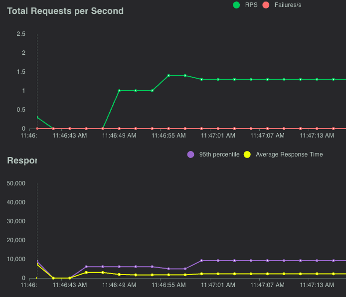

# RAG on PostgreSQL: Load testing

We recommend running a loadtest for your expected number of users.
You can use the [locust tool](https://docs.locust.io/) with the `locustfile.py` in this sample
or set up a loadtest with Azure Load Testing.

To use locust, first install the dev requirements that includes locust:

```shell
python -m pip install -r requirements-dev.txt
```

Or manually install locust:

```shell
python -m pip install locust
```

Then run the locust command, specifying the name of the User class to use from `locustfile.py` or using the default class. We've provided a `ChatUser` class that simulates a user asking questions and receiving answers.

```shell
locust
```

Open the locust UI at [http://localhost:8089/](http://localhost:8089/), the URI displayed in the terminal.

Start a new test with the URI of your website, e.g. `https://my-chat-app.containerapps.io`.
Do *not* end the URI with a slash. You can start by pointing at your localhost if you're concerned
more about load on OpenAI than on Azure Container Apps and PostgreSQL Flexible Server.

For the number of users and spawn rate, we recommend starting with 20 users and 1 users/second.
From there, you can keep increasing the number of users to simulate your expected load.

Here's an example loadtest for 20 users and a spawn rate of 1 per second:



After each test, check the local or App Service logs to see if there are any errors.
