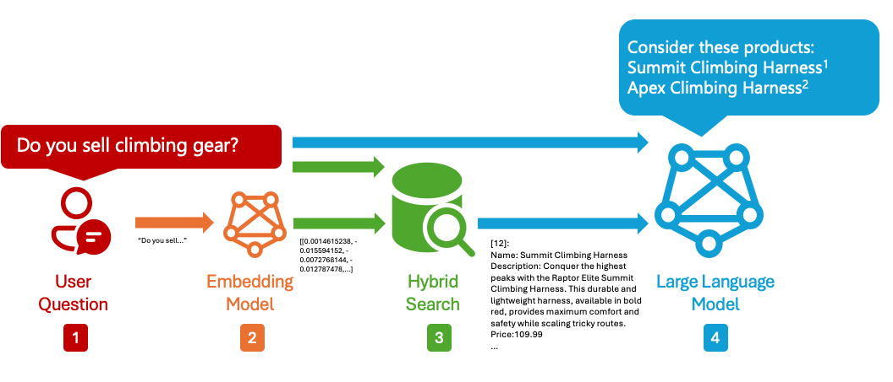
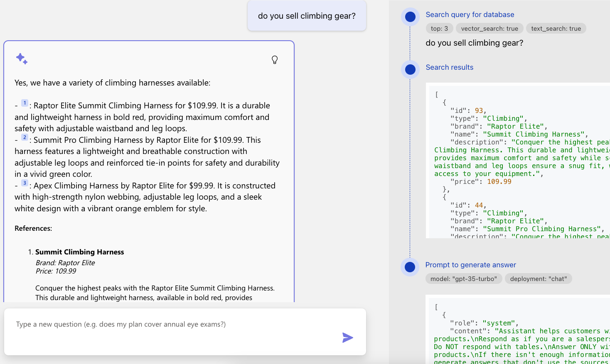
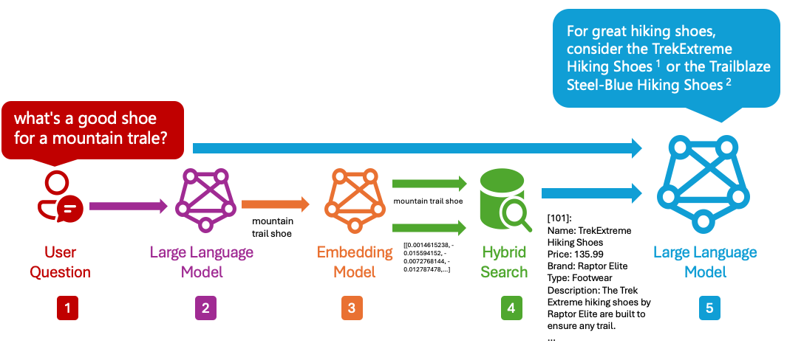
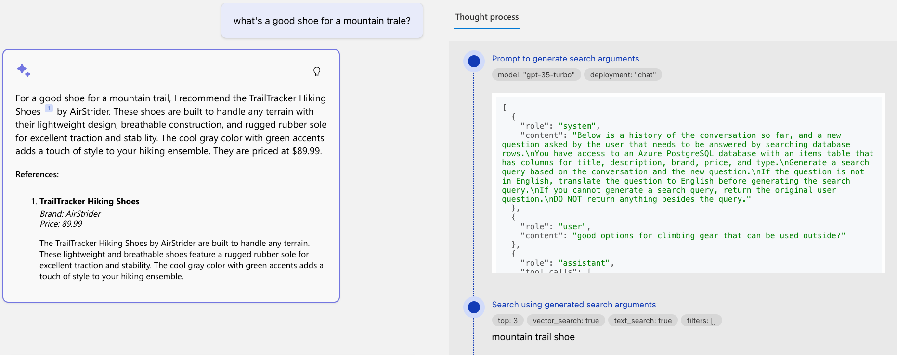
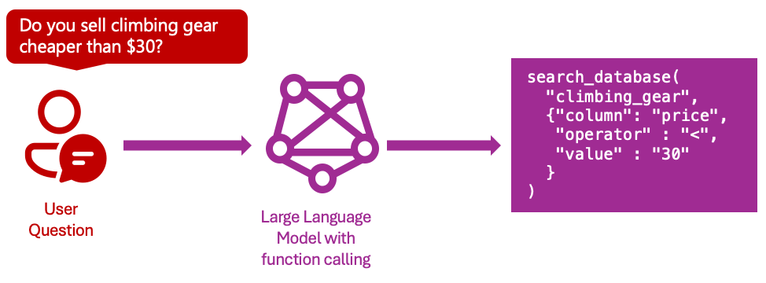

# RAG on PostgreSQL: Understanding the RAG flow

This RAG application uses an LLM to answer questions based off matching rows in a PostgreSQL database. It supports two different RAG flows:

* [Simple RAG flow](#simple-rag-flow): First searches the database for a matching row, then uses the LLM to generate an answer.
* [Advanced RAG flow](#advanced-rag-flow): Adds a query rewriting step before searching the database.

## Simple RAG flow

The simple flow is only used if you de-select the "Advanced flow" option in the Developer Settings dialog. We do not recommend this flow for production use, as it is less sophisticated, but it may be helpful for development and comparison.

This diagram shows the simple RAG flow:

1. The user asks a question.
2. The app uses an embedding model to generate a vector embedding for the question.
3. The app searches the target table in the PostgreSQL database using a hybrid search (full-text search plus vector search) to find the most relevant rows.
4. The app sends the original user question and the retrieved rows to the LLM to generate an answer.

When using the app, click the lightbulb on an answer to see the steps:

For the full code, see [/src/backend/fastapi_app/rag_simple.py](/src/backend/fastapi_app/rag_simple.py).

## Advanced RAG flow

The advanced flow is used if you select the "Advanced flow" option in the Developer Settings dialog, and is the default flow for the RAG application.

This diagram shows the advanced RAG flow:

The difference between the simple and advanced flows is an additional query rewriting step before the database search, which can improve the relevance of the search results. All the steps:

1. The user asks a question.
2. The app uses an LLM to rewrite the question into a text query that can be used to search the database.
3. The app uses an embedding model to generate a vector embedding for the rewritten text query.
4. The app searches the target table in the PostgreSQL database using a hybrid search (full-text search plus vector search) to find the most relevant rows.
5. The app sends the original user question and the retrieved rows to the LLM to generate an answer.

When using the app, click the lightbulb on an answer to see the query rewriting step call and its results.

For the full code, see [/src/backend/fastapi_app/rag_advanced.py](/src/backend/fastapi_app/rag_advanced.py).

### Query rewriting with function calling

Let's dive even deeper into the query rewriting step.

The query rewriting step uses [OpenAI function calling](https://platform.openai.com/docs/guides/function-calling) to generate the rewritten query. That function may also optionally specify column filters, which are then applied to the SQL query for the search step. For the sample data, the filters are for the "brand" and "price" columns, but you could change those to match your own [custom data schema](customize_data.md).

This diagram illustrates the function calling process for a sample question:

The `search_database` function definition is in [query_rewriter.py](/src/backend/fastapi_app/query_rewriter.py), and the few shot examples are in [query_fewshots.json](/src/backend/fastapi_app/prompts/query_fewshots.json). The function calling response is parsed in [query_rewriter.py](/src/backend/fastapi_app/query_rewriter.py) to extract the suggested SQL query and column filters, and those are passed to [postgres_searcher.py](/src/backend/fastapi_app/postgres_searcher.py) to search the database.

To be able to use function calling, the app must use a model that has support for it. The OpenAI GPT models do support function calling, but other models may not. If you're developing locally with Ollama, we recommend llama3.1 as it has been tested to work with function calling.
