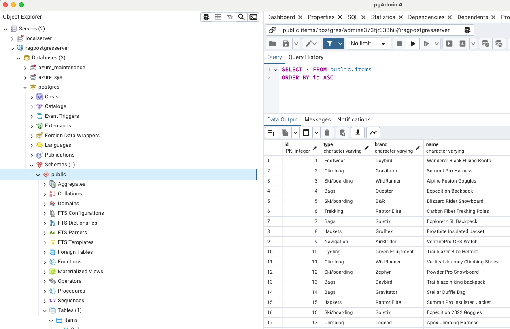

# Using Entra auth with PostgreSQL tools

To follow security best practices, this project is setup to use passwordless authentication with the Azure Database for PostgreSQL Flexible Server. This means that you can't connect to the database with a password, but instead need to use a token associated with a Microsoft Entra user. Locally, the user should be your own Azure account, whichever account was used to run `azd up`. In production, the user will be the managed identity assigned to the Azure Container App. 

Besides the tips here, more generic instructions about passwordless authentication are available in [Use Microsoft Entra ID for authentication with Azure Database for PostgreSQL - Flexible Server](https://learn.microsoft.com/azure/postgresql/flexible-server/how-to-configure-sign-in-azure-ad-authentication).

* [Using Entra auth with psql](#using-entra-auth-with-psql)
* [Using Entra auth with pgAdmin](#using-entra-auth-with-pgadmin)

## Using Entra auth with psql

1. Make sure you are logged into the Azure Developer CLI with the same account that was used to run `azd up`.

    ```shell
    azd auth login
    ```

    If you used a non-default tenant to run `azd up`, you may need to specify the tenant ID:

    ```shell
    azd auth login --tenant-id {tenant_id}
    ```

2. Generate a token for the Azure Database for PostgreSQL Flexible Server.

    ```shell
    azd auth token --scope https://ossrdbms-aad.database.windows.net/.default --output json
    ```

    Once again, if you used a non-default tenant to run `azd up`, you may need to specify the tenant ID.

    ```shell
    azd auth token --scope https://ossrdbms-aad.database.windows.net/.default --tenant-id YOUR-TENANT-ID --output json
    ```

    This will output JSON with a token inside the "token" field. Copy the token.

3. Set the `PGPASSWORD` environment variable to the token.

    ```shell
    export PGPASSWORD={token}
    ```

    If you are using a different shell, you may need to use a different syntax to set the environment variable.

4. Connect to the database with `psql`, using the `POSTGRES_HOST`, `POSTGRES_USERNAME`, and `POSTGRES_DATABASE` values from the current `azd` environment.

    ```shell
    psql -h $(azd env get-value POSTGRES_HOST) -U $(azd env get-value POSTGRES_USERNAME) -d $(azd env get-value POSTGRES_DATABASE) -p 5432
    ```

5. In psql, use `\d` to list the tables. When you `SELECT` from a table, select only the columns you're interested in, to avoid rendering the vector embeddings in the terminal. If you get an authentication error, you may need to refresh the token with a new one.

## Using Entra auth with pgAdmin

1. Make sure you are logged into the Azure Developer CLI with the same account that was used to run `azd up`.

    ```shell
    azd auth login
    ```

    If you used a non-default tenant to run `azd up`, you may need to specify the tenant ID:

    ```shell
    azd auth login --tenant-id {tenant_id}
    ```

2. Generate a token for the Azure Database for PostgreSQL Flexible Server.

    ```shell
    azd auth token --scope https://ossrdbms-aad.database.windows.net/.default --output json
    ```

    Once again, if you used a non-default tenant to run `azd up`, you may need to specify the tenant ID.

    ```shell
    azd auth token --scope https://ossrdbms-aad.database.windows.net/.default --tenant-id YOUR-TENANT-ID --output json
    ```

    This will output JSON with a token inside the "token" field. Copy the token.

3. Open pgAdmin and create a new server connection.

4. In the "General" tab, set the name to something memorable like "RAG PostgreSQL server".

5. In the "Connection" tab, set the host to the `POSTGRES_HOST` value from the current `azd` environment. Run:

    ```shell
    azd env get-value POSTGRES_HOST
    ```

6. Set the database to the `POSTGRES_DATABASE` value from the current `azd` environment. Run:

    ```shell
    azd env get-value POSTGRES_DATABASE
    ```

7. Set the username to the `POSTGRES_USERNAME` value from the current `azd` environment. Run:

    ```shell
    azd env get-value POSTGRES_USERNAME
    ```

8. Set the password to the token you generated in step 2. You will need to refresh that password with a new token periodically (every few hours).

9. Now you should be able to connect to the database and view the tables and data.

    
